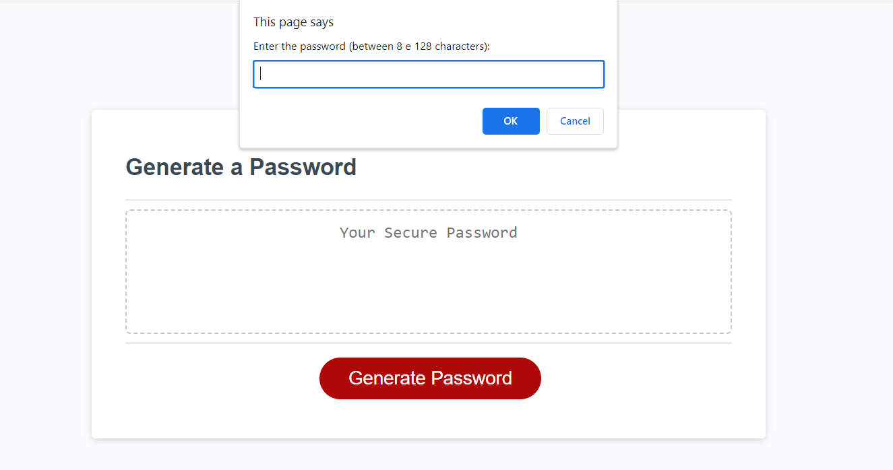

# Password-Generator
Code to generate a random password.

## Description

This is a page that an employee can use to generate a random password based on criteria they’ve selected.

## Installation

N/A

## Usage

This app will run in the browser, and will feature dynamically updated HTML and CSS powered by JavaScript to generate a random password.

## Deployed link

https://dhmed.github.io/Password-Generator/

## Credits

N/A

## License

Please refer to the LICENSE in the repo.